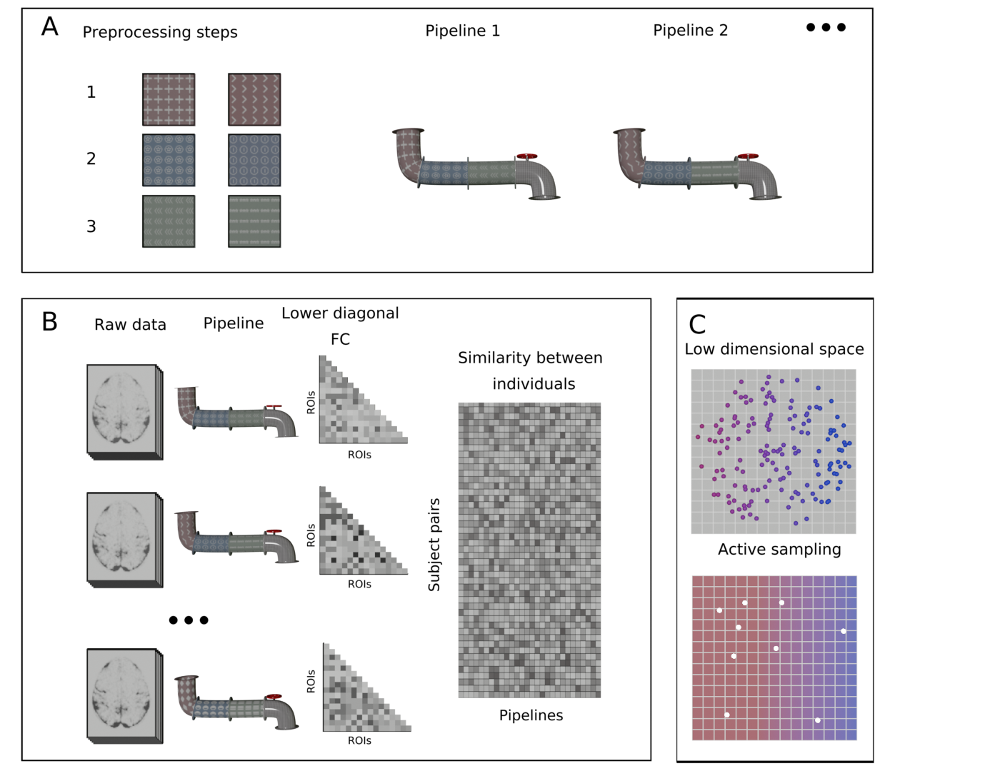

# Into the Multiverse

Code for the paper "Neuroimaging: Into the multiverse".

## Abstract

For most neuroimaging questions the huge range of possible analytic choices leads to the possibility that conclusions from any single analytic approach may be misleading. Examples of possible choices include the motion regression approach used and smoothing and threshold factors applied during the processing pipeline. Although it is possible to perform a multiverse analysis that evaluates all possible analytic choices, this can be computationally challenging and repeated sequential analyses on the same data can compromise inferential and predictive power. Here, we establish how active learning on a low-dimensional space that captures the inter-relationships between analysis approaches can be used to efficiently approximate the whole multiverse of analyses. This approach balances the benefits of a multiverse analysis without the accompanying cost to statistical power, computational power and the integrity of inferences. We illustrate this approach with a functional MRI dataset of functional connectivity across adolescence, demonstrating how a multiverse of graph theoretic and simple pre-processing steps can be efficiently navigated using active learning. Our study shows how this approach can identify the subset of analysis techniques (i.e., pipelines) which are best able to predict participants’ ages, as well as allowing the performance of different approaches to be quantified.

## Run the code
All the code can be run using Colab: 

## Citation
If you find this code useful, please cite: 

**Neuroimaging: Into the Multiverse,** 
*Jessica Dafflon, Pedro F. Da Costa, František Váša, Ricardo Pio Monti, Danilo Bzdok, Peter J. Hellyer, Federico Turkheimer, Jonathan Smallwood, Emily Jones, Robert Leech,* bioRxiv 2020.10.29.359778; doi: [https://doi.org/10.1101/2020.10.29.359778](https://www.biorxiv.org/content/10.1101/2020.10.29.359778v1)

